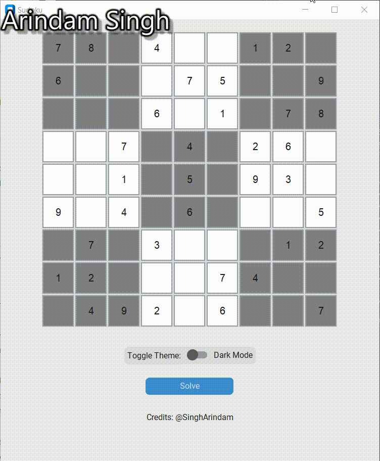
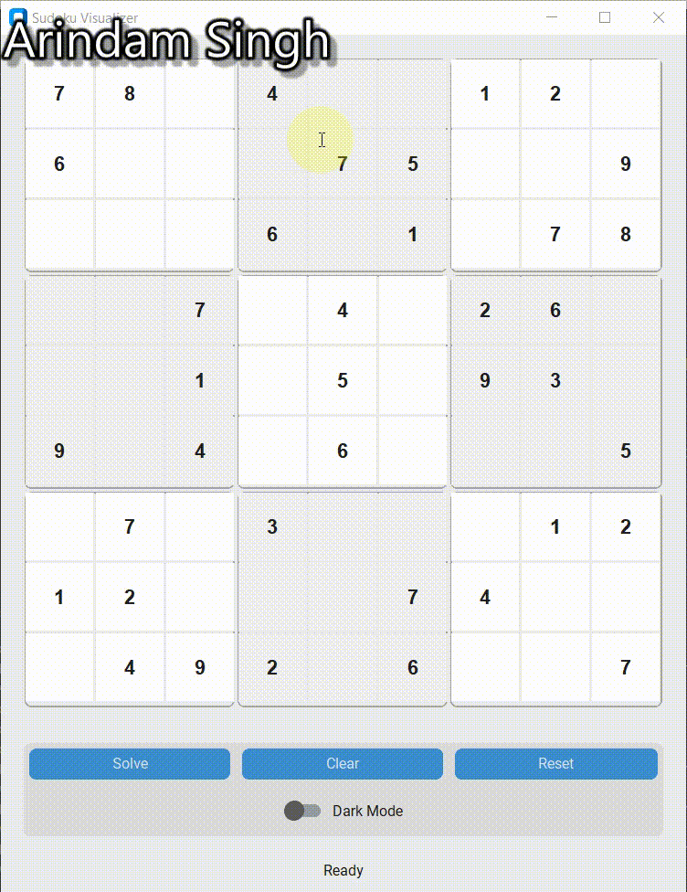
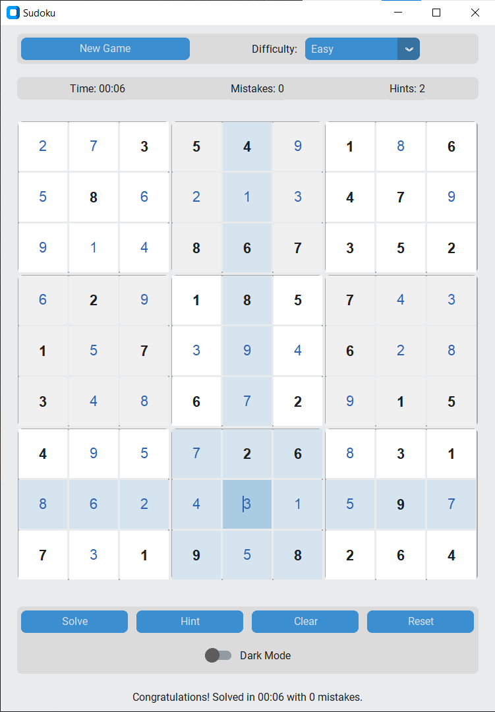

# Sudoku Solver & Visualizer

A visually appealing Sudoku application built with Python and CustomTkinter. It not only solves Sudoku puzzles using a backtracking algorithm but also provides an animated, step-by-step visualization of the process.

Run GUI.py or GUI_v2.py to play sudoku.

# How to Play
Click a box and hit the number on your keybaord to enter a number. It will validate if that value is correct or not. To delete a entered value use Delete. Finally to solve the board click "Solve", sit back and watch the algorithm run.

## Features

  - **Interactive Grid**: Click to select cells and get instant highlighting of the corresponding row, column, and 3x3 block.
  - **Dual Theme**: Easily switch between a sleek **Light Mode** and a modern **Dark Mode**.
  - **Live Validation**: Input numbers are validated in real-time against Sudoku rules.
  - **Animated Solving**: Watch the backtracking algorithm in action\! The solver visualizes placing numbers (green) and backtracking (red).
  - **Clear & Reset**: Easily clear your own inputs or reset the board to the original puzzle.

-----

## Demos





-----

## Alternative : Running the code

1.  **Prerequisites**: Make sure you have Python installed.
2.  **Install Libraries**:
    ```bash
    pip install customtkinter
    ```
3.  **Run the application**:
    ```bash
    python your_script_name.py
    ```


# Build InstructionsUsing PyInstaller
```
pyinstaller -F gui.py --collect-all customtkinter -w
```